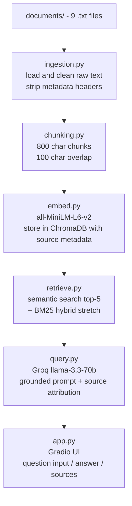

# Project 1 Planning: The Unofficial Guide

## Domain

LaunchMap is an AI internship prep guide for CS students. The domain covers
technical interview preparation, resume writing, AWS cloud certifications, and
structured prep programs like CodePath. This knowledge is valuable because it
is scattered across dozens of websites, GitHub repos, and program pages.
Students waste hours searching for it. There is no single place that answers
questions like "should I get AWS Cloud Practitioner before Solutions Architect"
or "what does CodePath TIP actually teach" alongside concrete interview advice.

## Documents

| # | Source | Description | URL or location |
|---|--------|-------------|-----------------|
| 1 | AWS Cloud Practitioner | Official cert page | documents/aws_cloud_practitioner.txt |
| 2 | AWS Solutions Architect | Official cert page | documents/aws_solutions_architect.txt |
| 3 | CodePath Applied AI | Official program page | documents/codepath_applied_ai.txt |
| 4 | CodePath TIP | Official program page | documents/codepath_tip.txt |
| 5 | Coding Interview University | GitHub README | documents/coding_interview_university.txt |
| 6 | Tech Interview Handbook - Interview Guide | Web guide | documents/interview_guide.txt |
| 7 | Tech Interview Handbook - Resume Guide | Web guide | documents/resume_guide.txt |
| 8 | Tech Interview Handbook - Cheatsheet | Web guide | documents/tech_interview_cheatsheet.txt |
| 9 | Tech Interview Handbook - Overview | GitHub README | documents/tech_interview_handbook.txt |

## Chunking Strategy

Chunk size: 800 characters
Overlap: 100 characters

Why these choices fit my documents: My documents are structured guides and
program pages, not short reviews. Key facts like exam details, prep steps,
and interview techniques span multiple sentences and need enough context to
be retrievable on their own. 800 characters captures roughly 2-4 paragraphs,
which is enough for a chunk to answer a specific question without pulling in
unrelated content. 100-character overlap prevents key information from being
lost at chunk boundaries. Chunks smaller than 500 characters would fragment
structured lists; chunks larger than 1200 would dilute specific facts.

Final chunk count: TBD after running ingestion pipeline

## Retrieval Approach

Embedding model: sentence-transformers/all-MiniLM-L6-v2
Top-k: 5

This model runs locally with no API key or rate limits. It produces
384-dimensional embeddings and performs well on English-language factual text.

Production tradeoff reflection: For a real deployment I would weigh context
length (all-MiniLM-L6-v2 caps at 256 tokens vs OpenAI text-embedding-3-small
at 8191), cost (local = free vs API = per token), accuracy (larger models
score higher on MTEB benchmarks), multilingual support, and latency (local
inference has no network round-trip but is slower on CPU).

For stretch features, I will implement hybrid search combining semantic
search with BM25 keyword search and compare results on the same queries.

## Evaluation Plan

1. What is the difference between AWS Cloud Practitioner and Solutions Architect?
   Expected: Cloud Practitioner is foundational, $100, 90 min, no experience
   required. Solutions Architect is associate level, $150, 130 min, recommends
   1 year hands-on AWS experience.

2. What does CodePath TIP teach and how do I apply?
   Expected: Free 10-week course covering UMPIRE method, algorithms, data
   structures, Big O. Apply via questionnaire and HackerRank assessment.

3. What should I do after finishing coding in an interview?
   Expected: Do not announce done. Scan for bugs, brainstorm edge cases, step
   through code with test cases, reiterate time and space complexity.

4. What should I put in the projects section of my resume?
   Expected: At least 2 projects linked to GitHub, specific contributions
   and technologies used described.

5. What programming language should I use for coding interviews?
   Expected: Use the language you know best. Python, Java, C++, JavaScript
   are most common. Python recommended for conciseness.

## Anticipated Challenges

1. Chunk boundary splits: Documents use numbered lists and step-by-step
   instructions. If a boundary falls mid-list, retrieved chunks may be
   incomplete. Overlap helps but may not fully solve this.

2. Source overlap: Multiple documents cover similar topics like clarifying
   questions. A query might retrieve chunks from several sources saying the
   same thing rather than the most specific answer.

## AI Tool Plan

1. ingestion.py and chunking.py: I will give Claude this planning.md and ask
   it to implement document loading from documents/ folder, cleaning of
   SOURCE_TITLE/SOURCE_URL headers, and character-based chunking with
   800-character size and 100-character overlap.

2. embed.py and retrieve.py: I will give Claude the retrieval approach section
   and ask it to implement ChromaDB storage with source metadata and a
   retrieval function returning top-5 chunks with distances.

3. query.py and app.py: I will give Claude the grounding requirement and ask
   it to implement a Groq prompt that answers only from retrieved context
   and a Gradio interface showing answer and sources.

4. Hybrid search stretch: I will ask Claude to add BM25 using rank_bm25
   and combine scores with semantic search results.

## Architecture

